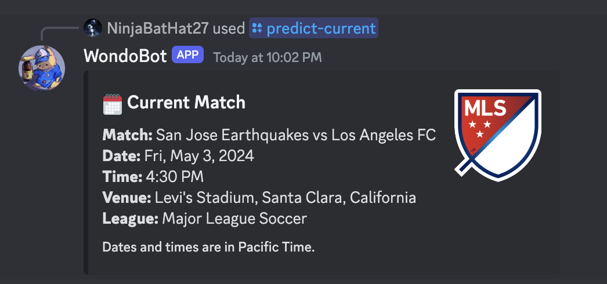
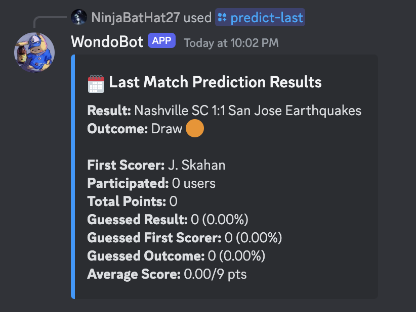
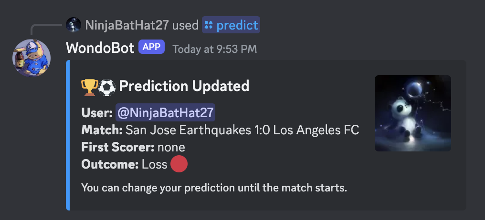
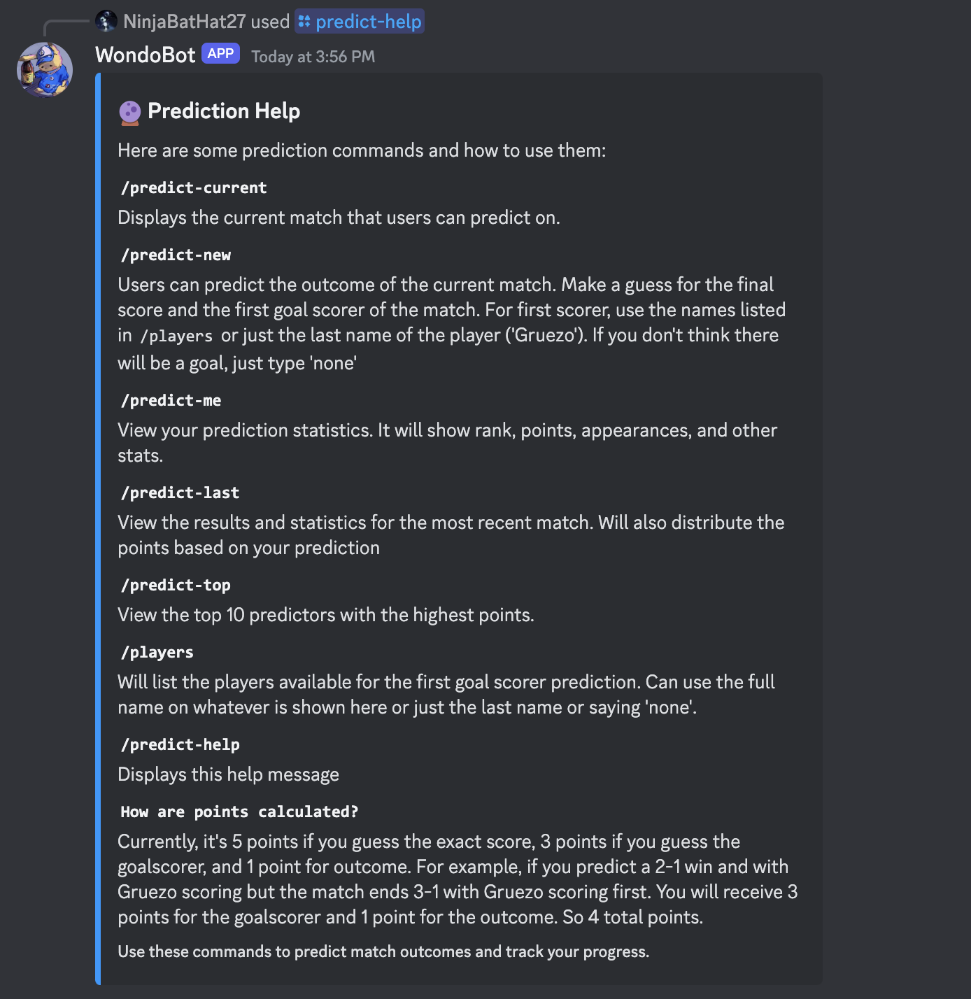

# WondoBot

WondoBot offers a platform on Discord for fans of the San Jose Earthquakes to predict football game outcomes. This Discord bot awards points to users based on the accuracy of their predictions compared to actual game results. By seamlessly integrating with the San Jose Earthquakes Discord Server, this bot creates a centralized hub where fans can gather to discuss, speculate, and anticipate the outcomes of upcoming matches. Additionally, it displays a list of users with the highest scores based on their predictions, among other features.

The bot includes several commands that enable users to interact effectively. The "predict" command allows users to predict match outcomes by inputting their score predictions for each team and the first scorer of the match. "Predict-current" provides information on the current or next match available for prediction. "Predict-top" displays a list of the top 10 predictors for a specific match. "Predict-last" shows the details of the last predicted match along with a summary. Finally, "all-matches" presents all past, present, and future matches for the San Jose Earthquakes.

